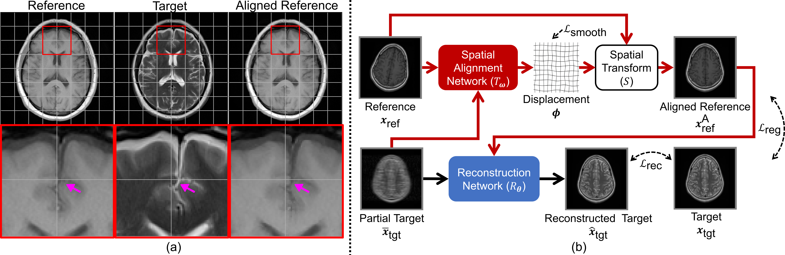

# Multi-Modal MRI Reconstruction Assisted with Spatial Alignment Network
## Abstract
In clinical practice, multi-modal magnetic resonance imaging (MRI)
with different contrasts is usually acquired in a single study
to assess different properties of the same region of interest in human body.
The whole acquisition process can be accelerated
by having one or more modalities under-sampled in the $k$-space.
Recent researches demonstrate that,
considering the redundancy between different modalities,
a target MRI modality under-sampled in the $k$-space
can be more efficiently reconstructed
with a fully-sampled reference MRI modality.
However, we find that the performance of 
the aforementioned multi-modal reconstruction can be negatively affected
by subtle spatial misalignment between different modalities,
which is actually common in clinical practice.
In this paper, we improve the quality of multi-modal reconstruction
by compensating for such spatial misalignment with a spatial alignment network.
First, our spatial alignment network estimates the displacement
between the fully-sampled reference and the under-sampled target images,
and warps the reference image accordingly.
Then, the aligned fully-sampled reference image joins
the multi-modal reconstruction of the under-sampled target image.
Also, considering the contrast difference between the target and reference images,
we have designed a cross-modality-synthesis-based registration loss
in combination with the reconstruction loss,
to jointly train the spatial alignment network and the reconstruction network.
The experiments on both clinical MRI and multi-coil $k$-space raw data demonstrate the superiority and robustness of the multi-modal MRI reconstruction empowered with our spatial alignment network.
Our code is publicly available at [https://github.com/woxuankai/SpatialAlignmentNetwork](https://github.com/woxuankai/SpatialAlignmentNetwork).

## Overview

The above figure is a real case demonstrating
the existence of spatial misalignment (a), and the overview of the proposed method (b).
In (a), a real case of multi-modal
MRI acquired for the diagnostic purpose demonstrates the existence
of spatial misalignment (highlighted by arrows) between the reference
(T1-weighted) and the target (T2-weighted) images.
The aligned reference image is also available to show
the effect of our proposed spatial alignment network.
In (b), a spatial alignment network is integrated into the multi-modal MRI reconstruction pipeline
to compensate for the spatial misalignment between the fully-sampled
reference image and the under-sampled target. The data flow for the
conventional deep-learning-based reconstruction is shown in black
arrows; and the red arrows are for additional data flow related to
our proposed spatial alignment network.

For more details on the proposed method, please refer to [https://ieeexplore.ieee.org/document/9745968](https://ieeexplore.ieee.org/document/9745968).

## Experiments on fastMRI DICOM
### Prepare data
Store data in h5 files
1. Unzip fastMRI brain DICOM to `fastMRI_brain_DICOM` folder.
2. Convert all dicom to `brain_nii` folder.
```bash
ls fastMRI_brain_DICOM | while read X; \
do XX="brain_nii/${X}"; mkdir ${XX}; \
echo "dcm2niix -z n -f '%j-%p' -o ${XX} fastMRI_brain_DICOM/${X} 2>${XX}/error.log 1>${XX}/out.log"; \
done | parallel --bar
```
3. Convert selected nii to h5.
```bash
# T1 modality
cat t1_t2_paired_6875_{train,val,test}.csv | cut -f1 -d ',' | while read x; \
do python3 convert_fastMRIDICOM.py "${x%.h5}.nii" "${x}" T1; \
done
# T2 modality
cat t1_t2_paired_6875_train.csv t1_t2_paired_6875_val.csv | cut -f2 -d ',' | while read x; \
do python3 convert_fastMRIDICOM.py "${x%.h5}.nii" "${x}" T2;
done
```

### Training & Evaluation
Run `commands_train_eval.sh` to start training and evaluation of methods.

## Cite This
```
@ARTICLE{9745968,
  author={Xuan, Kai and Xiang, Lei and Huang, Xiaoqian and Zhang, Lichi and Liao, Shu and Shen, Dinggang and Wang, Qian},
  journal={IEEE Transactions on Medical Imaging}, 
  title={Multi-Modal MRI Reconstruction Assisted with Spatial Alignment Network}, 
  year={2022},
  volume={},
  number={},
  pages={1-1},
  doi={10.1109/TMI.2022.3164050}}
```
